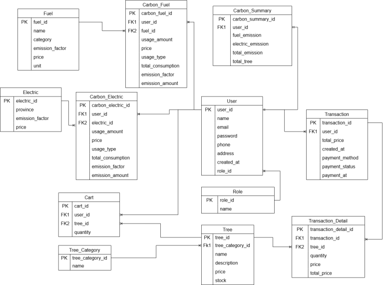
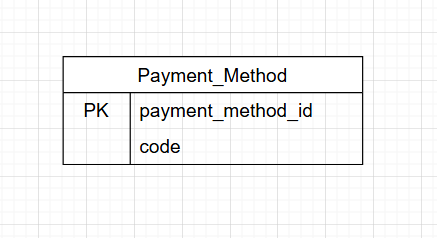

# Carbon

[Feel free to try this API. Click to access the documentation.](http://localhost:8080)

## Description: 

Carbon Management API goals is to calculate carbon (C02) emissions estimates for common C02 emitting activities.

## Background:

> Carbon API makes it easy to generate accurate emissions estimates from electricity consumption and fuel combustion.

## Highlights:

* Monolith Architecture
* Caching with Redis
* Serverless Deployment with Google Cloud Run
* Payment Gateway (Xendit)
* Email notifications

### Tech stacks:

* Go
* Echo
* Docker
* PostgreSQL
* MongoDB
* Redis
* GORM
* JWT-Authorization
* 3rd Party APIs (Xendit)
* SMTP
* REST
* Swagger
* Testify

## Application Flow


## ERD

### Carbon Services (Postgres)



### Payment Method Service (MongoDB)



## Deployment

This app is containerized and deployed to Google Cloud Run as a microservices. This means for each service (user_service, order_service, merchant_service, and api_gateway) is a separate instance. 

To deploy, go to the root folder for each service and type:

```bash
gcloud builds submit --pack image=gcr.io/[PROJECT-ID]/[SERVICE-NAME]
```

- __PROJECT-ID__ refers to the project's ID on Google Cloud Console.
- __SERVICE-NAME__ refers to the service name that you want to deploy. Example: carbon-service.
